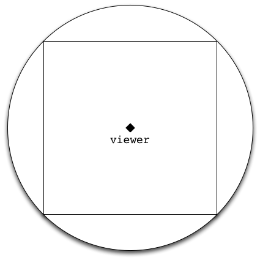
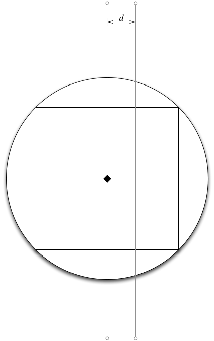
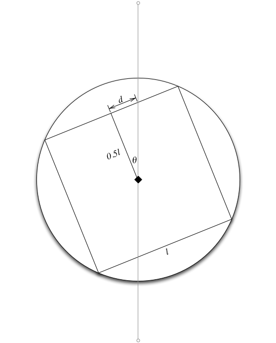
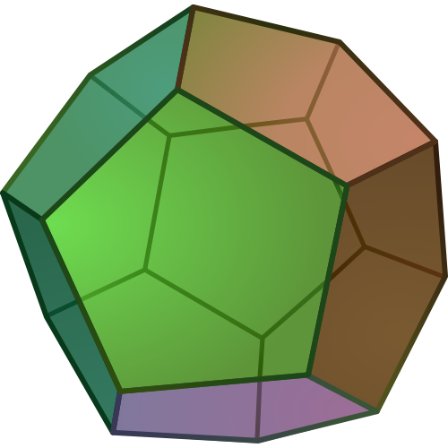
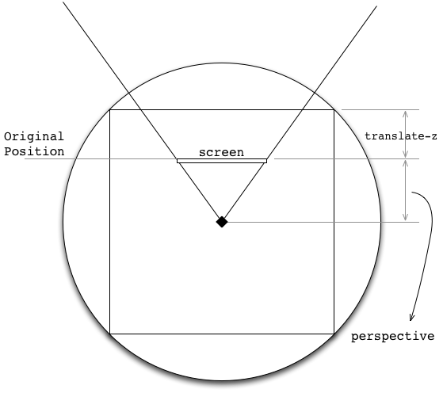

360-panorama
============

WebGL
-----

[three.js](http://othree.github.io/360-panorama/three-3d/) Example

* Use Case:
  * Google Street View
* Equirectangular Projection（等距圓柱投影）

* Paste this image on a sphere.
* Saw this kind of image before?

* Problems:
  * ProblemsMobile device not support WebGL
  * Android 4.1 native supports this format
  * Want to build a web service to serve this image format and support mobile device

CSS
---

* How about
  * Use hyperrectangular instead of sphere
    Which is much simpler
  * Cubic Projection !!

Demo: [CSS cubic](http://codepen.io/linmic/pen/hGmBp)

* Images!!

* How to get the image for six faces?
* Ref: [Converting an Equirectangular Panorama to Cubic Faces](http://vinayhacks.blogspot.tw/2010/11/converting-equirectangular-panorama-to.html)
  * CPAN Panotools for erect2cubic 
  * [Hugin](http://hugin.sourceforge.net/) for nona
  * `/Applications/Hugin/HuginTools/nona`
  * [See Here](https://github.com/othree/360-panorama/tree/master/css/texture)

How to control mouse drag?
--------------------------

* θ is ?

    theta = Math.atan2(0.5l, d);

Demo: [CSS #1](http://othree.github.io/360-panorama/css-first/)

* Somthing still wrong
* How about increase the face of the polygon

More Faces
----------

* Hard to generate images for dodecahedron
  * Use google stree view image API
  * Not perfect

Demo: [CSS dodecahedron](http://othree.github.io/360-panorama/dodecahedron/)

* Learned:
  * Use SVG clippath to clip the pentagon（五邊形）
    or you will see face overlape
  * Remember to center pentagon, it is smaller than the square.

* Problems
  * Must support SVG
  * Must work well when use both SVG and 3D transform

Back to Cubic
-------------

* Actually…
* My perspective is wrong on cubic version
 * Thanks bigcat

Demo: [CSS](http://othree.github.io/360-panorama/css/)

* Problem:
  * Canvas support is better than 3D transform (ref: caniuse)
 
Canvas 2D
---------

* three.js supports 2d canvas….
* Other 3D library also supports too.
  
Demo: [three.js](http://othree.github.io/360-panorama/three-2d/) 2D example, please open in Firefox.

* Implement 3d projection by 3D JS library

